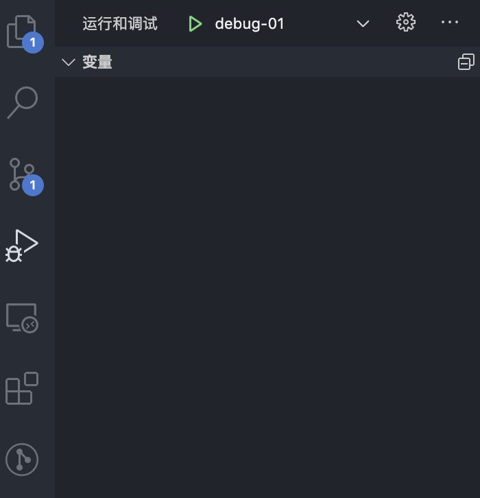

# 前端调试指南

## 背景

日常开发中，面对日益复杂的工程和项目，难免会遇到一些问题和bug，很多同学（包括我自己）的第一反应是打个 log 看一下情况，然后逐步找原因。这种方式很有效，能解决很多问题，但是效率相对地下，并且不够专业。

面对这种情况，笔者准备了一份前端调试指南，其中覆盖了日常开发中的大部分情况，例如：

- 调试 javascript
- 调试 node 服务
- 调试 typescript
- 调试 typescript 服务
- 调试 typescript 前端项目

如果读者对调试前端也有刚需，这份指南或许对你有用。为保证效果，建议读者边实践边阅读这份指南，调试代码[在这里](https://github.com/WangYuLue/node-debug-sample)

## 前期准备

环境： node:v14+
编辑器：VS Code

全局安装 `nodemon`、`ts-node`、`parcel`

```bash
yarn global add nodemon
yarn global add ts-node
yarn global add parcel
```

```bash
# 安装依赖
yarn
```

tips: 下面例子中，例如 `debug01`，指的是 vscode 中的调试按钮，如下图：



### 1、调试原生 node

参考 `demo01`, 用 `debug01` 启动调试

```json
{
  "type": "node",
  "request": "launch",
  "name": "debug-01",
  "program": "${workspaceFolder}/demo01/index.js",
}
```

### 2、调试原生 node 服务

以 `express` 为例：

参考 `demo02`, 用 `debug02` 启动调试

```json
{
  "type": "node",
  "request": "launch",
  "name": "debug-02",
  "program": "${workspaceFolder}/demo02/index.js",
}
```

### 3、调试已启动的 node 服务

以 `express` 为例：

参考 `demo02`, 先用 `node index.js` 启动服务, 再用 `debug02.1` 开始调试

```json
{
  "type": "node",
  "request": "attach",
  "name": "debug-02.1",
  "processId": "${command:PickProcess}"
}
```

参考链接：

[VSCode 调试中 launch.json 配置不完全指南：调试已启动的 Node.js 程序](https://www.barretlee.com/blog/2019/03/18/debugging-in-vscode-tutorial/)

### 4、过滤不想调试的文件

参考 `demo03`, 用 `debug03` 启动调试

```js
{
  "type": "node",
  "request": "launch",
  "name": "debug-03",
  "program": "${workspaceFolder}/demo03/index.js",
  "skipFiles": [
    // 跳过 js 内部代码
    "<node_internals>/**",
    // 跳过指定文件代码
    "${workspaceFolder}/demo03/util.js"
  ],
}
```

参考链接：

[VS Code: Skipping uninteresting code](https://code.visualstudio.com/docs/nodejs/nodejs-debugging#_skipping-uninteresting-code-node-chrome)

### 5、调试 typescript

参考 `demo04`, 用 `debug04` 启动调试

#### (1)、第一步：编写 tsconfig.json 文件

`tsc` 编译时会用到 `tsconfig.json` 配置文件

```js
{
  // 编译配置项
  "compilerOptions": {
    "allowSyntheticDefaultImports": true,
    // 输出文件夹
    "outDir": "out",
    // 编译生成 map 文件，这个配置对调试至关重要
    "sourceMap": true
  },
  // 需要编译的文件
  "files": [
    "./index.ts"
  ]
}
```

#### (2)、第二步：编写 launch.json 文件

```json
{
  "type": "node",
  "request": "launch",
  "name": "debug-04",
  "preLaunchTask": "build-demo04",
  "program": "${workspaceFolder}/demo04/index.ts",
  "outFiles": [
    "${workspaceFolder}/demo04/out/**/*.js"
  ],
}
```

注意这里新的配置参数 `preLaunchTask`，他表示在调试之前需要执行的任务，这个需要在 `tasks.json` 中编写，下面会讲到；

#### (3)、第三步：编写 tasks.json 文件

```json
{
  "version": "2.0.0",
  "tasks": [
    {
      "label": "build-demo04",
      "type": "shell",
      "command": "cd demo04 && tsc"
    }
  ]
}
```

`task` 详细用法参考[官方文档](https://code.visualstudio.com/docs/editor/tasks)

> 注意 `demo04` 中的 `package.json`, 它虽然是个空文件，但是是比不可少的，因为项目根目录的 `package.json` 采用了 `"type": "module"` 模式，调试会受此影响，所以用一个空的 `package.json` 来隔绝这个影响

### 6、调试 typescript 服务

参考 `demo05`, 用 `debug05` 启动调试

### 7、typescript 动态更新

参考 `demo06`, 借助 `nodemon` 的能力；这里写了 `nodemon.json` 配置文件，直接在 demo 目录下运行 `nodemon` 命令即可运行；

参考链接：

[StackOverFlow: How to watch and reload ts-node when TypeScript files change](https://stackoverflow.com/questions/37979489/how-to-watch-and-reload-ts-node-when-typescript-files-change)

### 8、调试 html 文件

这需要借助 `Debugger for Chrome` 插件来调试，下载这个插件；

参考 `demo07`, 用 `debug07` 启动调试

```json
{
  "type": "chrome",
  "request": "launch",
  "name": "debug-07",
  "file": "${workspaceFolder}/demo07/index.html"
}
```

### 9、调试前端项目

这需要借助 `Debugger for Chrome` 插件来调试，下载这个插件；

这个例子中用 `parcel` 来启动项目；

参考 `demo07`；

进入 demo07, 用 `parcel index.html --port 8899` 启动项目，用 `debug07.1` 启动调试：

```json
{
  "type": "chrome",
  "request": "launch",
  "name": "debug-07.1",
  "url": "http://localhost:8899/index.html",
  "webRoot": "${workspaceFolder}/demo07"
}
```

### 10、调试 typescript 前端项目（由 parcel 启动）

这个例子中用 `parcel` 来启动项目；

这需要借助 `Debugger for Chrome` 插件来调试，下载这个插件；

参考 `demo08`, 以 `react` 为例；

进入 demo08，`yarn` 下载依赖，并用 `parcel index.html --port 8899` 启动项目，用 `debug08` 启动调试：

```js
{
  "type": "chrome",
  "request": "launch",
  "name": "debug-08",
  "url": "http://localhost:8899",
  "webRoot": "${workspaceFolder}/demo08",
  "sourceMapPathOverrides": {
    "../*": "${workspaceFolder}/demo08/*" // 或者：  "../*": "${webRoot}/*"
  }
}
```

注意上面的 `sourceMapPathOverrides` 字段，它表示源路径从 sourcemap 到这些源在磁盘上的位置的映射。当源代码不准确或者无法在构建过程中修复时，这种方法很有用。

参考链接：

[VS Code: Debugger for Chrome](https://marketplace.visualstudio.com/items?itemName=msjsdiag.debugger-for-chrome)

[Parcel Docs](https://parceljs.org/debugging.html)

### 11、调试 typescript 前端项目（由 webpack 启动）

这个例子中用 `webpack` 来启动项目；

这需要借助 `Debugger for Chrome` 插件来调试，下载这个插件；

参考 `demo09`, 以 `react` 为例；

进入 demo09，`yarn` 下载依赖，并用 `yarn start` 启动项目，用 `debug09` 启动调试：

```js
{
  "type": "chrome",
  "request": "launch",
  "name": "debug-09",
  "url": "http://localhost:8899",
  "webRoot": "${workspaceFolder}/demo09",
  "sourceMapPathOverrides": {
    "webpack:///./~/*": "${webRoot}/node_modules/*", // Example: "webpack:///./~/querystring/index.js" -> "/Users/me/project/node_modules/querystring/index.js"
    "webpack:///./*": "${webRoot}/*", // Example: "webpack:///./src/app.js" -> "/Users/me/project/src/app.js",
    "webpack:///*": "*", // Example: "webpack:///project/app.ts" -> "/project/app.ts"
    "webpack:///src/*": "${webRoot}/*", // Example: "webpack:///src/app.js" -> "/Users/me/project/app.js"
  }
}
```

注意上面的 `sourceMapPathOverrides` 字段，参考自 [VS Code: Debugger for Chrome](https://marketplace.visualstudio.com/items?itemName=msjsdiag.debugger-for-chrome) 文档

注意点：在 `webpack` 的配置中，需要设置 `devtool: 'source-map'`

```js
module.exports = merge(config, {
  mode: 'development',
  devtool: 'source-map', // 这里需要设置成 source-map 用来生成 map 文件
  devServer: {
    port: 8899
  }
})
```
